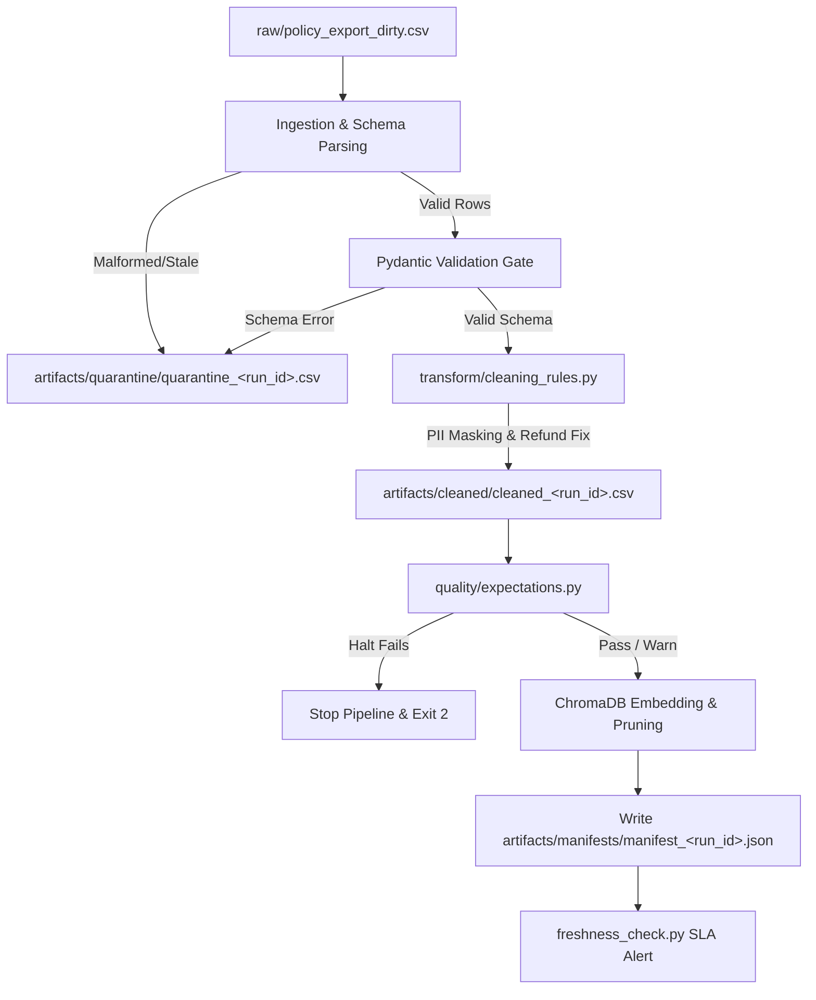

# Kiến Trúc Pipeline — Lab Day 10

**Nhóm:** AI-IT-Support-Team  
**Cập nhật:** 2026-06-10

---

## 1. Sơ đồ luồng (Pipeline Diagram)

- **Điểm đo Freshness:** Đo tại thời điểm **Publish** (ChromaDB) thông qua việc ghi nhận `run_timestamp` và so sánh với watermark `latest_exported_at` của dữ liệu nguồn.
- **Run ID:** Được tự động sinh dạng UTC timestamp (ví dụ `2026-06-10T08-30Z`) hoặc truyền qua `--run-id` để đánh dấu dấu vết audit (lineage) xuyên suốt logs, manifests, cleaned, và quarantine files.
- **Quarantine File:** Chứa tất cả bản ghi bẩn kèm cột lý do (`reason`) để dễ dàng gỡ lỗi dữ liệu nguồn.

---

## 2. Ranh giới trách nhiệm

| Thành phần | Input | Output | Owner nhóm |
|------------|-------|--------|--------------|
| **Ingest** | `data/raw/policy_export_dirty.csv` | CSV rows, mapped column structures | Ingestion / Raw Owner |
| **Transform** | Raw CSV rows | Cleaned CSV rows + Quarantine rows (PII masked, refund window fixed) | Cleaning & Quality Owner |
| **Quality** | Cleaned CSV rows | Expectation results (HALT or WARN decisions) | Cleaning & Quality Owner |
| **Embed** | Cleaned CSV rows | Updated ChromaDB collection (`day10_kb`), pruning stale vectors | Embed & Idempotency Owner |
| **Monitor** | Pipeline run manifest | Freshness SLI/SLA status & alert signals | Monitoring / Docs Owner |

---

## 3. Idempotency & Rerun

- **Sinh ID ổn định (Stable Chunk ID):** `chunk_id` được sinh theo công thức băm ổn định: `{doc_id}_{seq}_{hash}` trong đó hash là `sha256(doc_id|chunk_text|seq)[:16]`. Điều này đảm bảo nội dung trùng lặp hoặc chạy lại nhiều lần vẫn cho ra cùng một `chunk_id`.
- **Chống phình tài nguyên (Idempotent Embed):** Embed sử dụng phương thức `col.upsert` của ChromaDB. Khi chạy lại pipeline với cùng bộ dữ liệu, ChromaDB sẽ ghi đè các bản ghi cũ thay vì chèn trùng lặp.
- **Publish Boundary Pruning:** Sau khi upsert, pipeline thực hiện quét toàn bộ ID hiện có trong Collection và xóa đi các ID **không xuất hiện** trong lượt chạy cleaned hiện tại (được ghi nhận trong log `embed_prune_removed`). Điều này triệt tiêu hoàn toàn rác/vector lỗi thời từ các lần inject bẩn cũ.

---

## 4. Liên hệ Day 09

Pipeline này cung cấp corpus tri thức sạch và cập nhật nhất cho Retrieval của hệ thống Multi-Agent Day 09.
- Thay vì truy vấn trực tiếp từ tài liệu văn bản gốc có thể bị lỗi hoặc cũ, Agent Day 09 sẽ truy vấn trực tiếp từ Chroma Collection `day10_kb`.
- Sự phân tầng này giúp cô lập logic làm sạch dữ liệu khỏi logic suy luận của Agent, đảm bảo Agent luôn "đọc đúng phiên bản chính sách đang có hiệu lực".

---

## 5. Rủi ro đã biết

- **Lệch múi giờ (Timezone Skew):** Trường `exported_at` ở hệ thống nguồn không có thông tin timezone có thể gây tính toán lệch giờ khi so sánh với `now(timezone.utc)`. Đã khắc phục bằng cách tự động ép múi giờ UTC nếu thiếu.
- **Thay đổi Schema đột ngột (Schema Drift):** Nếu tệp export nguồn đổi tên cột, Pydantic validation sẽ chặn đứng và quarantine toàn bộ tệp, tránh làm hỏng vector store phục vụ Agent.
